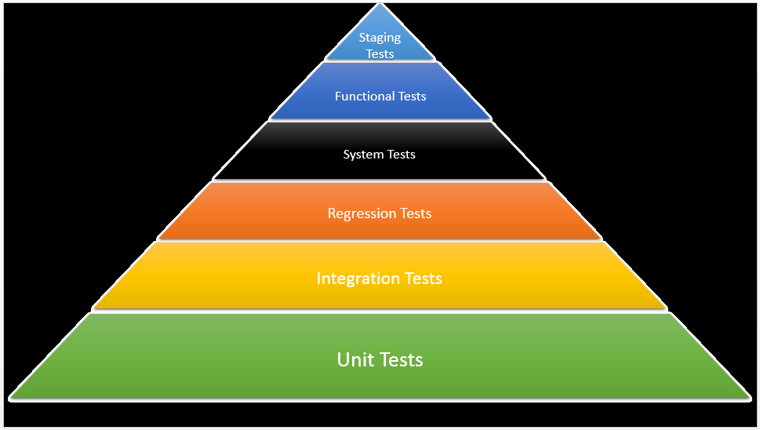

# C++ Unit Testing with googletest

An introduction to C++ Unit Testing using googletest framework.

## Basics

    
What is a Unit Test?

A unit test is a piece of code developed with the purpose of testing production code. A unit test will interact with a production code unit to ensure that it is working well. All this is done in a controlled and pre-designed environment, where inputs and outputs are known.

    
Qualities of a good Unit Test

-	Independent and repeatable
-	Can be automated
-	Runs fast
-	Easy to identify the root cause when it fails
-	Focus on functionality, not on implementation
-	Easy to understand and maintainable

_The closer we are to the code, the more tests we should have._
For that reason, unit test should be the most abundant tests.

    
Types of Tests

1.	**Unit Test** – standalone test not related to other resources. It is run frequently.
2.	**Integration Test** – tests the correct interaction of the various components of the entire application, multiple packages, and several components. It also tests interaction with external resources.
3.	**Regression Test** – Testing of a previously tested program following modification to ensure that defects have not been introduced or uncovered in unchanged areas of the software, as a result of the changes made. It is to make sure that the application provides the same outcome.
4.	**System Test** – tests a system as a black box. While this test, you watch your SUT (System Under Test) with an external point of view. You perform stress tests, monitor memory usage, and check response time.
5.	**Acceptance / Functional Test** – validates that a feature or use case is correctly implemented, testing the system against functional requirements. They are generally performed by Quality Assurance teams and/or with the clients.
6.	**Staging Test** – These tests are run in a production-like environment. Input data are forked in live both to the production platform and the staging platform.

---

## Google Test framework

[googletest](https://github.com/google/googletest) is a testing framework developed by the Testing Technology team with Google’s specific requirements and constraints in mind.

    
Basics

- When using googletest, you start by writing assertions, which are statements that check whether a condition is true. An assertion’s result can be **success**, **nonfatal failure**, or **fatal failure**.
- A test suite contains one or many tests. You should group your tests into test suites that reflect the structure of the tested code. When multiple tests in a test suite need to share common objects and subroutines, you can put them into a test fixture class.
- A test program can contain multiple test suites.

    
Assertions

